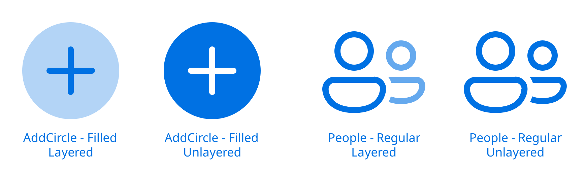
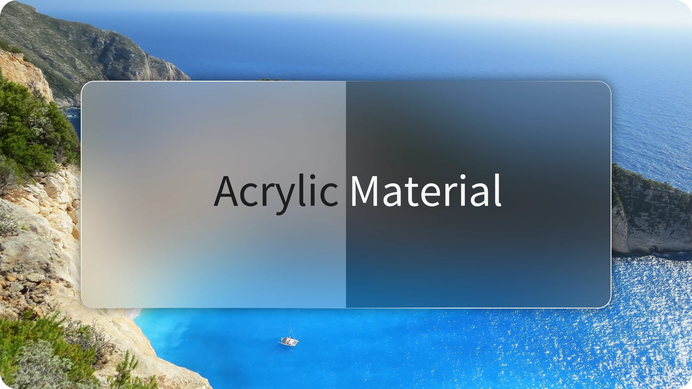

<div align="center">
<div>
    <h1>UIKit</h1>
</div>
<div>
    <p><a href="README.md">简体中文</a> | English</p>
</div>

<span>
    <a href="LICENSE.txt"></a>
    <a href="https://github.com/MillenTec/UIKit/releases/latest"></a>
</span>
</div>

---

> [!TIP]
> The English version was translated by AI.

UIKit is a modern, minimalist Compose Multiplatform component library built on Fluent Design while incorporating Apple design principles. It is dedicated to delivering an Apple iOS-level visual and interactive experience across the two primary platforms: Windows and Android. Most components are completely self-drawn, providing a consistent visual and interactive experience across multiple platforms. At the same time, certain controls exhibit differences between desktop and mobile to improve the cross-platform user experience.

If you're looking to quickly explore a design language beyond Material Design in Compose Multiplatform, UIKit will certainly meet your needs.

## 1. Project Overview
UIKit is currently under development, and not all controls are complete.

### 1.1. Features
- **Cross-Platform Consistency:** All core component code is implemented purely with Compose in commonMain, with fallbacks provided on other platforms for platform-specific features.
- **Ease of Use and High Customizability:** Most controls offer multi-layered APIs, allowing you to create a beautiful control with default configuration in just a few lines of code, or use lower-level APIs for more extensive customization.
- **Complete Theming System:** `UIKitTheme` provides six customizable, mutable theme attributes: colors, typography, shapes, layout, animations, and materials. Light and dark configurations are built-in. Simply wrap your application root with `UIKitTheme` and provide your theme configuration, and you can access the theme anywhere in your app using `getUIKitTheme`.
- **Smooth Animation System:** UIKit advocates that everything should have transitions. Animations and transition effects permeate every aspect of UIKit's design.
- **Rich Icon Set:** UIKit's built-in icons are based on [FluentUI System Icons](https://github.com/microsoft/fluentui-system-icons) and have been further refined, offering a more diverse icon system including **layered icons**, **animated icons**, and more.

### 1.2. Supported Platforms
| Platform | Support Status |
| -------- | -------------- |
| Android (minSdk 24) | 🟢 |
| iOS | 🟡 (Mostly supported) |
| Windows (JVM) | 🟢 |
| macOS (JVM) | 🟡 (Theoretically fully supported) |
| Linux (JVM) | 🟡 (Theoretically fully supported) |

UIKit currently focuses on **Android** and **Windows (JVM)** platforms, with priority given to Android (mobile).

Since I do not own a Mac or iPhone device, I am unable to test or develop for the iOS platform. Although the vast majority of the project is self-drawn with Compose Multiplatform, compatibility and user experience on iOS remain uncertain without real-device testing.

If you own a Mac device, are familiar with iOS development, and are interested in this project, contributions are welcome.

macOS and Linux have not been tested on actual hardware either, but since they are also JVM-based, most functionality should work without issues.

## 2. Getting Started
You can open this project using JetBrains IntelliJ IDEA, ensuring that `JDK`, `Gradle`, and the `Kotlin Multiplatform` plugin are installed and configured. The JDK and Gradle versions used during development are as follows (recommended):
- **JDK 21**
- **Gradle 9.5**

After Gradle finishes loading, you can run the `*Example` module directly or use UIKit in your own project.

UIKit is not yet published to `Maven Central`. You can publish it locally and reference it:
```sh
git clone https://github.com/MillenTec/UIKit.git
cd UIKit/src
./gradlew :uikitMain:publishToMavenLocal
```
Then, in the project where you want to reference UIKit:
```kt
// settings.gradle.kts - repository configuration
repositories {
    mavenLocal()
    // ... other repositories
}

// build.gradle.kts - dependency configuration (commonMain)
dependencies {
    implementation("com.millentec.uikit:uikit:0.0.1-dev")
}
```

Then re-sync your Gradle project to verify that UIKit works correctly.

## 3. Design
### 3.1. Theming System
In `UIKitTheme` (class), you can use `getLight()` or `getDark()` to retrieve the default light or dark theme and pass it to `UIKitTheme` (Composition). Creating a `UIKitTheme` instance directly defaults to the light theme.
```kt
@Composable
fun App() {
    UIKitTheme(UIKitTheme.getLight()) {
        Box(
            Modifier
                .fillMaxSize()
                .background(getUIKitColors().contentFillColorPrimaryBrush)
            )
    }
}
```
`UIKitTheme` is essentially a `CompositionLocalProvider`. Accessing theme values with `getUIKitColors()` is equivalent to `UIKitTheme.LocalTheme.current.colors`. If no `UIKitTheme` wrapper is present in the upper layers of your app, `getUIKitTheme` defaults to the light theme.

You can create an observable property in your application and pass it to `UIKitTheme`, updating it to change the theme:
```kt
@Composable
fun App() {
    val checked = remember { mutableStateOf(false) }

    UIKitTheme(
        if (checked) UIKitTheme.getDark() else UIKitTheme.getLight()
    ) {
        Box(
            Modifier
                .fillMaxSize()
                .background(getUIKitColors().contentFillColorPrimaryBrush)
        ) {
            UIKitToggleSwitch(
                checked = checked.value,
                onCheckedChange = {
                    checked.value = it
                }
            )
        }
    }
}
```

### 3.2. Icons
UIKit provides a large set of icons based on [FluentUI System Icons](https://github.com/microsoft/fluentui-system-icons), most of which are available as `ImageVector` for direct use.

#### 3.2.1. Static Icons

I have manually layered each of these icons one by one. The original FluentUI System Icons are monochromatic, single-layer filled icons. Now you can choose to layer them and fill each layer with different colors.



You can access all Regular (non-filled) static icons under `FluentIcons`, or all Filled static icons under `FluentIcons.Filled`. Static icons are divided into **layered static icons** and **non-layered static icons**. For non-layered static icons, you can call them directly:
```kt
FluentIcons.Accessibility
```
Layered static icons offer three levels of API:
```kt
// The simplest API, returns a monochromatic, non-layered icon with default color 0xFF1D1D1F
FluentIcons.addCircle()

// The `color` parameter sets the base color; if `layered` is true, returns a layered icon with different opacity levels applied to each layer. If false, equivalent to the first API but with custom color.
// For layered icons, this API is generally recommended.
FluentIcons.addCircle(
    color = getUIKitColors().highlightColorPrimaryBrush,
    layered = true
)

// The lowest-level API, allows specifying a brush for each layer; the number of parameters depends on the actual icon.
FluentIcons.addCircle(
    primary = SolidColor(getUIKitColors().highlightColorPrimaryBrush),
    secondary = SolidColor(getUIKitColors().highlightColorPrimaryBrush.copy(alpha = 0.6f))
)
```

#### 3.2.2. Animated Icons
Under `FluentIcons.AnimatableIcons`, you'll find animated icons. These are not `ImageVector` types but composables driven by `Canvas`. You can set their size using `Modifier.size`, and they scale proportionally.

#### 3.2.3. Resizable Icons
Under `FluentIcons.ResizableIcons`, there are icons with adjustable stroke widths. These are of type `ImageVector`.

### 3.3. Materials
UIKit provides `AcrylicMaterial`, which includes background blur and edge highlights. Default properties can be configured in `UIKitAcrylicMaterial`.

Background blur is powered by the open-source library [Cloudy](https://github.com/skydoves/Cloudy).


> [!TIP]
> The background image used in the acrylic effect demo is from [Pixabay](https://pixabay.com/zh/photos/beach-cliff-bay-sea-ocean-418742/) ([License Summary](https://pixabay.com/service/license-summary/)).

To use acrylic material, first create a state with `rememberAcrylicMaterialsState`, set a source, and apply the material to a container:
```kt
Box {
    val state = rememberAcrylicMaterialsState()

    Box(
        modifier = Modifier
            .acrylicMaterialSource(state)
    ) { 
        // ...
    }

    Box(
        modifier = Modifier
            .acrylicMaterial(state = state)
    ) {
        // ... 
    }
}
```

> [!IMPORTANT]
> Do not use an `AcrylicMaterial` with the same state as its source inside the child hierarchy of `AcrylicMaterialSource`. In other words, an `AcrylicMaterial` cannot have itself as its source, as this will cause a crash:
> ```kt
> Box {
>    val state = rememberAcrylicMaterialsState()
>
>    Box(
>        modifier = Modifier
>            .acrylicMaterialSource(state)
>    ) { 
>        Box(
>           modifier = Modifier
>               .acrylicMaterial(state = state)  // ❌ This will cause a crash
>        ) {
>            // ... 
>        }
>    }
> }
> ```

## 4. License
This project is open-sourced under the **[MIT License](LICENSE.txt)**, which grants you the right to:
- Deal in the Software without restriction, including without limitation the rights to **use, copy, modify, merge, publish, distribute, sublicense, and/or sell** copies of the Software.

However, you must:
- **Retain the copyright notice:** The copyright notice and permission notice shall be included in all copies or substantial portions of the Software.

UIKit also relies on the support of the open-source community. All third-party open-source software used by UIKit and their licenses are listed in [THIRD_PARTY.txt](THIRD_PARTY.txt).

## 5. About Me
I am a high school student from China, a tech enthusiast, programming hobbyist, self-taught developer, and anime fan. In May of this year (2026), I was introduced to the Kotlin language and the Compose Multiplatform framework, fell in love with this declarative UI framework, and began diving deeper into learning and using it. I started developing UIKit after my junior high school academic proficiency exam in early July of the same year.

### 5.1. Contact Me
- MillenTec@outlook.com
- [GitHub](https://github.com/MillenTec)
- [Gitee](https://gitee.com/MillenTec)
- [bilibili](https://space.bilibili.com/3546591566760474)

If you like UIKit, please give it a Star!